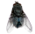

<html lang="{{ site.lang | default: "en-US" }}">
  <head>
	  <title>You've Found An Easter Egg</title>
    <meta name="viewport" content="width=device-width, initial-scale=1">
    <meta charset="utf-8">
	<link rel="stylesheet" href="{{ site.baseurl }}/swatter/swatter.css">
  </head>
  <body>
    <a href="{{ site.baseurl }}/swatter/swatter.png" target="_blank" id="flyFrame">
	

		

			x
		

	

	
	
		
	
	<em id="gplink">
		Swat?
	</em>
</a>
    </body>
